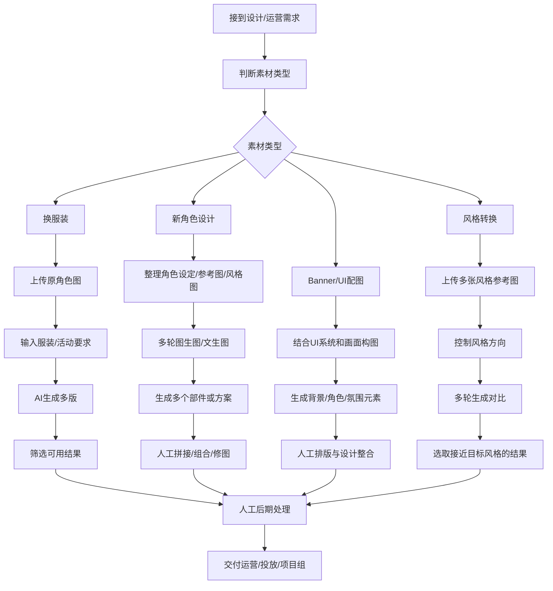

# 美术组访谈需求整理 - AI 中台

> 更新时间：2026-06-03
> 目的：基于美术组实际访谈，把需求与当前 AI 中台已有能力对齐，标注“已有 / 部分已有 / 需新增”，并评估新增难度。
> 参考：当前项目实现、灰测自测报告、EasyRouter 官方 API 文档（图像 `/v1/images/generations`、多模态 chat completions、视频 `/v1/videos` 异步任务）、Midjourney / Runway / Krea / Leonardo / Adobe Firefly 等同类平台公开文档。

## 0. 与当前项目的对齐结论

### 0.1 当前项目已经具备的能力

| 能力 | 当前状态 | 说明 |
|---|---|---|
| 文生图 | 已有 | 生成页支持图片 prompt、模型选择、比例、张数、任务入库、结果展示、下载。当前本地环境 `EASYROUTER_MODE=mock`，真实模型需切 `real`。 |
| 单参考图图生图 | 部分已有 | 前端可上传 PNG/JPEG/WebP ≤20MB，后端会校验、保存参考图并传给 provider；但灰测发现轮询响应未稳定带回 `reference_image_url`，刷新后参考图展示仍需修补。 |
| 文生视频 | 部分已有 | 支持视频 tab、5s/10s、异步任务、轮询、落库。mock 模式返回 SVG 占位，不能验证真实视频播放。EasyRouter provider 已有 `/v1/videos` create/poll/download 骨架。 |
| 图生视频 | 部分已有 | 视频接口支持单张参考图，EasyRouter provider 中使用 `body.image` 传参考图；真实效果需要切 EasyRouter real 后专项验证。 |
| 多图生成 | 部分已有 | 已支持 1/2/4 张；清单中的 3 张不支持，API 和前端都会限制为 1/2/4。 |
| 会话与主标签 | 已有但体验需优化 | 每个会话有主标签，生成必须先选主标签；本次用途默认沿用主标签并允许单次覆盖。现有问题是主标签必选引导弱、主标签和本次用途语义容易混。 |
| 资产库 | 已有 | 可查看生成历史、下载、收藏筛选、硬删任务及产物。 |
| output 级收藏 | 已有 | 多图任务支持收藏单张 output。 |
| 用量/成本/看板 | 已有 | `/profile`、`/admin`、`/manager/dashboard` 已按 Supabase 数据统计任务、积分、成本、部门权限。 |
| 报销 | 已有 | 员工提交报销、管理员审核、全员汇总统计已具备。 |
| 模型管理基础 | 部分已有 | `models` 表支持 provider、type、baseline、priority、metadata；admin 有模型记录/看板，但“按美术场景推荐模型”还未产品化。 |

### 0.2 当前项目暂不具备或仅有雏形的能力

| 能力 | 当前缺口 | 初步难度 |
|---|---|---|
| 多参考图输入 | 目前**只支持单参考图字段** `reference_image_url`，任务表也只存单值 | 中-高 |
| 多参考图权重 | 需要 UI、数据结构、provider schema 适配；**不同模型是否支持权重不一致** | 高 |
| 换服装专用模式 | 根据访谈对象所言，应该此功能比较可控，仅需**新增一个换服装的标签即可** | 中 |
| 风格转换专用模式 | 基础版可做 prompt 模板 + 单参考图；稳定风格迁移需要多参考图/模型选择/多轮对比 | 中-高 |
| 拆图/抠图/分层 | 当前没有 segmentation / background removal / layer extraction pipeline | 高 |
| Banner/UI 合成工作台 | 当前只生成单张图，不支持画布、图层、文本排版、组件约束 | 高 |

### 0.3 EasyRouter 接入理解

- 图片能力：EasyRouter 提供 OpenAI 兼容图片生成端点 `/v1/images/generations`，项目中已为 `gpt-image-* / dall-e-*` 走该端点；Gemini 2.5 Flash Image 等多模态图像模型走 `/chat/completions` 并从返回内容中解析图片 data URL。
- 视频能力：EasyRouter 视频是异步模式，项目中已实现 `POST /v1/videos` 创建、`GET /v1/videos/{id}` 轮询、完成后下载视频二进制并落盘。
- 当前限制：项目内 `GenerateImageParams` / `GenerateVideoParams` 都只有一个 `reference_image_url`；OpenAI Images generation 分支不支持参考图，参考图编辑需另接 `/v1/images/edits` 类能力；视频时长在项目里通过 prompt control token `--dur` 处理。
- 产品含义：EasyRouter 可以作为真实模型层，**但美术组需求里的“多参考图、权重、拆图、稳定换装、风格一致性”不是单纯换 provider 就自动解决，需要产品交互、数据结构和模型选择一起补。**

## 1. 访谈对象
| 字段 | 内容 |
|---|---|
| 访谈对象 | 美术组同事 |
| 角色定位 | 游戏美术 / 设计支持 |
| 主要使用场景 | 广告素材、角色素材、服装变体、Banner 图、UI 配图、风格转换 |
| AI 使用方式 | 以图生图为主，文生图为辅 |
| 核心结论 | 美术组更关注参考图控制、风格一致性、细节准确性、多图生成、素材拆分与后期拼接能力 |

## 2. 访谈内容结构化总结

### 2.1 使用方式
- 美术组更常使用图生图，文生图作为辅助。
- 基于已有角色、服装、风格继续生成新图。
- Prompt 只是辅助，参考图和风格控制才是核心。

### 2.2 素材类型拆分
| 素材类型 | 使用场景 | 复杂度 | AI 适配度 | 备注 |
|---|---|---|---|---|
| 换服装 | 已有角色更换服饰 | 低-中 | 高 | AI 可以直接修改 |
| 新角色 | 新角色概念/部件生成 | 高 | 中 | 需要生成多图并人工拼接 |
| Banner 图 | 广告/活动图 | 高 | 中 | 需结合 UI 系统 |
| UI 配图 | 功能/背景装饰图 | 高 | 中 | 需考虑界面协调 |
| 风格转换 | 转换目标风格 | 高 | 中-高 | 高频难点 |
| 拆图 | 拆角色、背景、道具 | 中 | 低-中 | 当前靠人工手拆 |

### 2.3 美术组真实工作流

### 2.4 关键痛点
- **图生图能力**是核心，文生图是辅。
- **提示词手搓多**，Prompt 辅助需要分场景。
- **多图生成**是反复调试和拼接组合的需求。
- **风格控制**难度大，细节一致性问题明显。
- **拆图**能力缺失，当前靠人工。

## 3. 需求功能表：美术组视角

| 需求编号 | 模块 | 功能名称 | 需求描述 | 当前项目状态 | 使用场景 | 业务价值 | 优先级 | 实现难度 | 成本影响 | MVP建议 |
|---|---|---|---|---|---|---|---|---|---|---|
| 1 | 创建素材 | 图生图生成 | 上传参考图生成新图 | **部分已有**：单参考图上传、校验、落盘、传 provider 已有；刷新后参考图展示需修补 | 换服装、角色、Banner | 高效生成符合美术风格素材 | P0 | 中 | 中 |已有|
| 2 | 创建素材 | 换服装模式 | 基于已有角色图生成不同服装版本 | 需新增模式入口：底层可复用图生图；缺少换装模板、参考强度、保脸/保体态说明 | 活动皮肤、节日服装 | 高频稳定场景 | P0 | 中 | 中 | P0 小模式：做“换服装”快捷模板，不先承诺 100% 一致 |
| 3 | 创建素材 | 新角色概念生成 | 多图概念探索，生成角色部件 | 缺少角色设定表、多参考图、部件拆分 | 新角色设计 | 概念探索效率 | P2 | 中-高 | 中 | 部分纳入：先支持多方案探索 + 收藏对比，部件拆分后续 |
| 4 | 创建素材 | Banner 图生成 | 生成适合广告/活动 Banner 的元素 | 部分已有：可生成图；缺少 文案安全区、UI排版工作台**（即，缺少局部重绘的功能）** | 活动图、广告图 | 辅助设计产出 | P1 | 中-高 | 中 | 基础版纳入：增加 Banner 场景 prompt 模板和比例预设 |
| 5 | 创建素材 | 风格转换 | 将素材转换为目标风格 | 部分已有底层：单参考图 + prompt 可试；缺少多参考风格图、风格锁定、批量对比 | 素材统一风格 | 核心高难点 | P0/P1 | 高 | 中 | 基础版纳入：先新增风格转换这个场景，根据收集来的数据再作进一步规划 |
| 6 | 素材处理 | AI 拆图 | 自动分离角色、背景、道具 | 未有：无 segmentation / remove background / layer pipeline | 后期拼接 | 提效明显 | P1/P2 | 高 | 中 | 后续：需要单独接抠图/分割服务或模型 |
| 7 | 多参考图 | 多参考图权重 | 控制不同参考图对生成结果影响 | 未有：当前接口和 DB 都是单参考图 | 风格融合 | 提升风格控制能力 | P2 | 高 | 中 | 后续：先做多参考图无权重，再评估 provider 是否支持权重 |

## 4. 已有功能与访谈需求的映射

### 4.1 可以直接用于美术组灰测的功能

| 访谈需求 | 可用功能 | 灰测注意点 |
|---|---|---|
| 文生图辅助 | 生成页图片 tab | 当前 mock 不代表真实质量；需 EasyRouter real 小样本验证。 |
| 多版本选择 | 1/2/4 张输出 + output 级收藏 | 目前不支持 3 张；建议灰测话术改为“1/2/4 张”。 |
| 素材复用 | 资产库、下载、收藏筛选 | 已支持硬删、收藏、下载；适合美术沉淀候选素材。 |
| 会话化探索 | 多会话、置顶、重命名 | 会话重命名超长/换行 bug 尚未修，灰测前建议修。 |
| 用途归因 | 主标签 + 本次用途 | 当前体验容易困惑，需优化引导；否则美术同事会以为写了 prompt 也不能生成。 |
| 成本/用量可见 | 个人/管理员/经理看板 | mock 成本只做流程验证；真实成本需 EasyRouter real 后校准 credits。 |

### 

## 5. 新增需求难度拆解

### 5.1 低难度（1-2 天级，主要是 UI/配置）

| 需求 | 改动点 | 风险 |
|---|---|---|
| 模型适用场景说明 | 扩展 `models.metadata` 或配置文案，在模型下拉展示“适合换装/风格/Banner”等 | 需要真实试用后校准，不宜只靠猜 |
| 支持与ai多轮交流出图 | 会话形式改为流式的对话，跟ai聊天的时候会附带有之前的聊天信息 | 采用这类方式后的速度待测 |

### 5.2 高难度（1-3 周级，涉及 schema/provider/新服务）

| 需求 | 改动点 | 风险 |
|---|---|---|
| 多参考图 | DB 从单 `reference_image_url` 改为多附件表或 JSON；前端上传/预览/排序；provider 适配 | 不同模型支持多图方式不同，且采用这类方式后的速度待测 |
| 多参考图权重 | UI 权重控制、prompt/请求 schema 映射、模型兼容矩阵 | 很多模型不支持显式权重，只能 prompt 软控制 |
| AI 拆图/抠图/分层 | 接入分割/抠图服务，产物变多层资产，资产库支持分组 | 成本、质量、版权边界都要评估 |
| Banner/UI 工作台 | 画布、图层、文本、组件、导出尺寸、模板系统 | 已接近新产品模块，不应塞进生成页 MVP |

思考：

是否新增文件夹模式，多版本探索的时候，可以把会话统一到一个文件夹里，查数据更方便，美术组侧也方便管理查看；

风险点：不知道美术组侧是否有分组的习惯，若没有人使用此功能则其实是纯粹浪费人力物力

## 6. 建议路线图

### 6.1 美术组第一轮可交付后观察数据

| 功能 | 备注 | 观察数据 |
|---|---|---|
| 图生图基础版 | 上传单张参考图 + prompt 生成，结果/参考图可回看 | 观察生成和下载的比例（设计埋点） |
| 多版本探索 | 此功能如何观测数据，待细化 |  |
| 换服装快捷模板 | 新增“换服装”的分类 | 观察此分类下的提示词情况，以及生成和下载的比例（设计埋点） |
| 风格转换快捷模板 | 新增“风格转换”的分类 | 观察此分类下的提示词情况，以及生成和下载的比例（设计埋点） |

### 6.2 第二轮再评估

- 多参考图上传：先不做权重，只做多张参考图 + 顺序说明。
- Prompt 辅助：分析参考图，生成服装结构/颜色/材质/风格词。
- AI 拆图：评估是否接第三方抠图/分割 API。
- Banner/UI 工作台：如果美术组确实高频需要，再拆成独立模块（可能涉及要接入支持局部重合的工具）。

## 7. 风险与产品提醒

- **标签体系风险**：当前主标签和本次用途读同一批 `purpose_tags`，用户自定义标签可能全员可见，容易冗杂。美术组灰测前建议限制自定义标签作用域或先关闭新增。
- **成本风险**：多版本生成和视频生成会明显增加成本；看板已有积分统计，但真实 EasyRouter cost 需要校准模型单价。
- ⭐**数据沉淀风险**：美术素材需要按项目/角色/活动归档；当前只有会话、资产、收藏，缺少项目维度和素材包概念。

## 8. 同类竞品平台功能调研补充

### 8.1 可重点参考的平台与板块

| 平台 | 建议参考板块 | 公开链接 | 对本项目的启发 |
|---|---|---|---|
| Midjourney | Organize / Folders / Moodboards / Editor | [Organize](https://docs.midjourney.com/hc/en-us/articles/33329462451469-Organizing-Your-Creations)、[Folders](https://docs.midjourney.com/hc/en-us/articles/34580542725645-Using-Folders)、[Moodboards](https://docs.midjourney.com/hc/en-us/articles/39193335040013-Moodboards)、[Editor](https://docs.midjourney.com/hc/en-us/articles/32764383466893-Full-Editor) | 资产组织、文件夹、按项目生成、风格板、局部编辑，是美术组后续最值得抄作业的方向。 |
| Krea/ liblibAI | Realtime / Edit / Enhance / Training | [What is Krea](https://docs.krea.ai/get-started/what-is-krea)、[Realtime](https://docs.krea.ai/user-guide/features/realtime) | 实时画布、编辑增强、自定义风格训练，适合当作远期“美术工作台”的方向，而不是当前 MVP 直接照搬。 |

### 8.2 值得预设进产品的信息架构

| 竞品能力 | 当前项目是否已有 | 建议预设方式 | 优先级 |
|---|---|---|---|
| 项目/文件夹组织 | 部分已有：有会话和资产库，无项目维度 | 新增“项目/素材包”概念；会话、任务、资产都可以归属到项目 | P0/P1 |
| 已经生成的图片快捷作为垫图再次生成新图 | 未有 | 资产库中，选择了特定图片，可以支持一键发送给ai，修改提示词后再次生成新的图 | P1 |
| 生成在指定文件夹/项目内 | 未有 | 进入某项目后生成，任务自动落到该项目；比现在只靠主标签更自然 | P2 |
| 参考图库 / Reference Library | 部分已有：上传参考图但没有长期库 | 把参考图作为一类资产保存，可命名、复用、按项目共享 | P1 |
| 多参考图 | 未有 | 先支持 2-3 张参考图，不急着做权重；每张图标注用途：角色/服装/风格/构图 | P1 |
| 风格板 / Moodboard | 未有 | 根据已有数据再做后续规划 | P1/P2 |
| 局部编辑 / Inpainting | 未有 | 不建议立即做；先记录为高价值后续模块 | P2 |
| 输出图一键转视频 | 部分已有：有图生视频接口骨架 | 在图片结果卡增加“生成视频”入口，自动把当前 output 作为视频参考图 | P1 |
| 批量操作 | 部分已有：资产筛选/下载，但批量能力弱 | 资产库增加多选、批量下载、批量移动项目、批量收藏 | P1 |
| 搜索与筛选 | 部分已有：资产库基础筛选 | 增加按 prompt、模型、比例、主标签、项目、参考图、收藏状态搜索 | P1 |

### 8.3 对当前需求表的补充判断

-  “多参考图权重”不建议一开始直接做权重。竞品更常见的第一步是先让用户保存和复用 Reference，再区分 Reference 的用途；权重是第二阶段。
-  “风格转换”应拆成两个产品概念：Style Reference（风格）和 Structure Reference（构图/版式）。如果不拆，美术会觉得上传参考图后模型“不听话”，但其实是系统没有问清楚要参考什么。**（待具体调研）**
- “拆图/抠图/分层”很有价值，但更像资产后处理模块。当前项目最好先把“生成结果可管理、可复用、可二次生成”打牢，再接抠图/分割服务。
- ART-005 “Banner 图生成”不应只做一个 prompt 模板。真正可用的 Banner 工作流需要尺寸、安全区、文案区域、角色/背景/装饰层的关系；短期可以先做“比例 + 用途模板 + 参考图”。

## 9. 后续打法建议

### 9.1 第一阶段：确保已用功能使用正常，且能正常收集数据

目标不是一次做成完整设计软件，而是让美术组愿意真实拿来试。

1. 修复当前已知体验问题：主标签引导、会话名溢出、参考图回显、多图数量文档一致。
2. 确定具体埋点体系，如何收集数据，收集哪些数据
3. 确定标签体系，会有哪些标签功能；标签功能如何分类，如何存库（推荐还是不同的部门有不同的标签，可与对应部门的负责人沟通？）

### 9.2 第二阶段：建立“项目 + 参考图库 + 资产库”的闭环

这是竞品里最值得优先吸收的部分，也最贴合美术组真实工作。

1. 新增项目/素材包：按游戏项目、活动、角色、投放主题归档。
2. 新增 Reference Library：参考图可命名、复用、归属项目。
4. 资产库支持批量操作和搜索：按项目、模型、用途、prompt、收藏、时间过滤。
5. 结果图一键转视频：让“图生图 -> 挑图 -> 图生视频”成为连贯路径。

### 9.3 第三阶段：再做高控制能力

等真实使用数据出来后，再决定哪些高难功能值得投入。

| 方向 | 是否建议做 | 判断依据 |
|---|---|---|
| 多参考图 | 建议做 | 美术访谈和 Runway/Leonardo/Krea 都说明这是核心能力。 |
| 多参考图权重 | 暂缓 | 先看接入模型是否支持；如果模型不支持，只能做 prompt 软控制。 |
| 风格板 / Moodboard | 建议做 | 对角色、活动、项目风格统一很有价值，且比训练模型轻。 |
| 自定义风格训练 | 后置 | 价值高，但需要数据集、成本、权限和质量评估。 |
| 局部编辑 / 画布 | 后置 | 很强但工程量大，容易从 AI 中台变成专业设计软件。 |
| 拆图 / 抠图 | 可专项评估 | 如果美术反馈高频，建议单独接服务，不要混进生成接口。 |

### 9.4 推荐的产品取舍

- 先做“美术能稳定复用”的能力，而不是“看起来最炫”的能力。
- 先把参考图从一次性上传变成可管理资产，再谈多参考图和权重。
- 先把项目归档做好，再扩展标签体系，否则所有用户共用标签会越来越乱。
- 先用人工维护的模型适用说明降低试错，再逐步引入自动模型推荐。
- 先让输出结果能继续生成、转视频、进项目库，形成闭环；单次生成质量不完美时，也能通过流程提高可用率。

## 10. 老板视角的数据看板补充建议

### 10.1 当前看板的主要问题

当前项目的数据看板已经具备用量、报销、部门、模型、AI 洞察等基础模块，但从公司老板视角看，还不够“一眼判断值不值得继续投”。现在的数据更像 admin 运维台，能看到谁用了多少、花了多少钱、哪个部门活跃，但还没有把这些数据组织成经营问题：

- AI 投入到底有没有换来产出？
- 哪些部门真正把 AI 用进工作流，而不是偶尔试用？
- 哪些模型/工具值得继续采购，哪些只是烧钱？
- 哪些素材、项目、场景带来了实际业务价值？
- 是否存在成本失控、重复采购、部门闲置、异常使用？
- 管理层下一步应该批准预算、收紧额度，还是推动培训？

### 10.2 老板最想看的 6 类核心数据

| 看板视角 | 老板真正关心的问题 | 建议展示指标 | 当前项目状态 | 建议优先级 |
|---|---|---|---|---|
| 投入产出 | 花的钱有没有产出业务素材 | AI 总成本、生成任务数、可用素材数、收藏/下载/复用率、单个可用素材成本 | 部分已有：成本、任务、收藏、下载有基础；缺少“可用/采纳/复用”口径 | P0 |
| 部门采用率 | 哪些团队真的在用 | 部门活跃人数、活跃率、人均调用、连续使用天数、沉默部门 | 部分已有：部门用量、成员明细；缺少活跃率和连续使用 | P0 |
| 业务场景分布 | AI 主要被用在哪些业务 | 按用途/项目/素材类型统计：换装、Banner、风格转换、视频、UI 配图 | 部分已有：用途标签；缺少项目/素材类型维度 | P0/P1 |
| 成本健康 | 哪些地方在烧钱 | 部门预算使用率、模型成本 Top、单任务成本、视频成本占比、异常高成本任务 | 部分已有：积分、报销、模型异动；真实成本口径需校准 | P0 |
| 资产沉淀 | 生成结果有没有沉淀为公司资产 | 资产库数量、收藏率、下载率、二次生成率、项目归档率、参考图复用率 | 部分已有：资产库/收藏/下载；缺少项目归档和二次生成链路 | P1 |
| 管理动作 | 现在该做什么决策 | 超额预警、低活跃提醒、模型采购建议、培训建议、额度调整建议 | 部分已有：AI 洞察页雏形；需要从“信号”升级为“动作建议” | P1 |

### 10.3 建议新增的老板驾驶舱结构

老板不需要一上来看到很多明细表，而是需要先看到“结论 + 风险 + 动作”。建议在现有 admin/manager 数据看板之上，增加一个更高层的“经营驾驶舱”视角。

| 区块 | 展示内容 | 设计意图 |
|---|---|---|
| 第一屏 4 个核心 KPI | 本月 AI 总投入、本月有效产出、活跃部门/人数、预计月末成本 | 先回答“花了多少、产出多少、谁在用、会不会超”。 |
| ROI 趋势 | 成本、任务数、可用素材数、下载/收藏/复用率按月变化 | 让老板判断 AI 中台是越用越有效，还是只是在增加成本。 |
| 部门价值矩阵 | 横轴成本、纵轴产出/活跃率，按部门散点展示 | 区分“高投入高产出”“高投入低产出”“低投入高潜力”“低活跃需推动”。 |
| 模型/工具采购视图 | 模型成本、成功率、平均耗时、使用部门、适用场景 | 支持是否续费、加购、下架、限制某模型。 |
| 业务场景视图 | 按换装、Banner、风格转换、视频、UI 配图等统计成本和产出 | 看哪些业务场景最值得继续产品化。 |
| 风险与待处理 | 超预算、异常使用、低活跃部门、重复报销、模型成本突增 | 给老板“下一步该看哪里”的入口。 |
| 本月建议动作 | 系统生成 3-5 条管理建议：调额度、培训、模型采购、灰测扩展 | 从数据展示转为管理闭环。 |

### 10.4 关键指标口径建议

| 指标 | 建议定义 | 为什么重要 |
|---|---|---|
| 有效产出数 | 被收藏、下载、归档到项目、或被二次生成引用的 output 数 | 比“生成了多少张图”更接近真实价值。 |
| 有效产出率 | 有效产出数 / 总 output 数 | 判断模型和 prompt 工作流质量。 |
| 单有效素材成本 | 本月 AI 成本 / 有效产出数 | 老板最容易理解的 ROI 指标。 |
| 部门活跃率 | 本月使用过 AI 的部门成员数 / 部门总人数 | 判断推广是否真正进入团队。 |
| 连续使用人数 | 最近 7/14/30 天有连续使用行为的人数 | 区分尝鲜和稳定使用。 |
| 二次生成率 | 使用历史 output 或参考图继续生成的任务数 / 总任务数 | 反映资产是否形成创作闭环。 |
| 项目归档率 | 归属到具体项目/素材包的资产数 / 总资产数 | 反映资产是否能被管理和复用。 |
| 模型有效成本 | 某模型成本 / 该模型产生的有效产出数 | 比模型调用量 Top 更能指导采购。 |
| 失败/取消成本 | 失败、取消、不可用任务消耗的积分或金额 | 用于发现模型质量、接口稳定性或交互问题。 |
| 预算预测 | 按当前消耗速度预测月末成本 | 提前做额度和预算决策。 |

### 10.5 与当前项目已有数据的关系

| 当前已有数据 | 可以升级成的老板指标 | 还需要补什么 |
|---|---|---|
| `tasks` 任务记录 | 任务数、成功率、失败率、模型使用趋势 | 任务是否有效、是否被采纳、失败原因分类 |
| `task_outputs` 产物 | output 数、收藏率、下载率 | 归档项目、二次生成引用、人工标记“已采用/不可用” |
| `usage_events` / 积分 | 成本趋势、部门成本、模型成本 | 真实金额映射、单有效产出成本 |
| `purpose_tags` | 使用目的分布 | 标签作用域、项目维度、素材类型维度 |
| 部门/用户数据 | 部门活跃度、成员活跃度 | 部门总人数、角色、是否核心使用人 |
| 报销数据 | 外部工具支出、重复采购风险 | 工具类型、供应商、是否与中台功能重叠 |
| AI 洞察 | 风险提醒、行动建议 | 规则阈值、处理状态、处理结果回写 |

### 10.6 建议先补的埋点和数据字段

| 优先级 | 字段/事件 | 用途 |
|---|---|---|
| P0 | output 是否被下载、收藏、再次作为参考图 | 计算有效产出率和二次生成率。 |
| P0 | 任务失败原因、取消原因 | 识别模型问题、接口问题还是用户主动取消。 |
| P0 | 任务所属素材类型：换装、Banner、风格转换、视频、UI 配图 | 统计业务场景价值。 |
| P1 | 项目/素材包 ID | 支持按项目看成本、资产、产出。 |
| P1 | output 人工标记：已采用 / 待修改 / 不可用 | 让 ROI 口径更接近真实业务。 |
| P1 | 参考图类型：角色/服装/风格/构图/背景 | 支持分析不同参考图工作流的效果。 |
| P1 | 模型生成耗时和真实价格 | 支持采购与模型推荐。 |
| P2 | 素材最终投放/上线结果 | 如果后续能接运营数据，可以从“AI 产出”进一步走到“业务结果”。 |

### 10.7 老板视角的产品判断

- 当前看板不要再只强调“调用量多”，调用量多可能是效率提升，也可能是试错浪费。
- 比“生成多少”更重要的是“留下多少、复用了多少、实际采用多少”。
- 部门看板不只是排名，而应帮助发现四类团队：高产出标杆、成本异常团队、低活跃需培训团队、低成本高潜力团队。
- 模型看板不只是 Top 排名，而应看“单位有效产出成本、成功率、耗时、适用场景”。
- 报销看板可以和 AI 中台能力做对照：如果某类外部工具报销很高，说明中台可能需要补能力，或公司需要统一采购。
- AI 洞察页应从“数据提示”逐步升级到“管理建议”：给出证据、影响金额、建议动作、负责人和处理状态。

### 10.8 推荐落地顺序

1. 先补“有效产出”口径：收藏、下载、二次生成、人工采纳标记。
2. 再补“业务场景”口径：换装、风格转换、Banner、视频、UI 配图。
3. 然后做老板驾驶舱第一屏：AI 总投入、有效产出、活跃率、预计月末成本。
4. 再做部门价值矩阵：成本 × 产出/活跃率。
5. 最后把 AI 洞察升级成管理动作闭环：建议、证据、负责人、状态、处理结果。

### 10.9 当前已落地的老板驾驶舱原型

> 2026-06-03 已先复制并改造出一个独立老板视角看板原型。该版本不接真实数据库，全部使用演示数据，并在页面中明确标注“演示数据 / 待接真实口径”。

| 项目 | 当前实现 | 说明 |
|---|---|---|
| 页面入口 | `/admin_new` | 一级页面，不挂在 `/admin` 二级路径下，便于和原数据看板直接切换。 |
| 侧边栏 | 管理组新增“老板驾驶舱” | 原 `/admin` 仍保留为“数据看板”，`/admin_new` 独立高亮，避免两个入口混淆。 |
| 权限 | 仅 admin 可访问 | 非管理员沿用 admin forbidden 逻辑。 |
| 数据来源 | `lib/fixtures/executive-dashboard.ts` | 当前全部是假数据，用于展示目标信息架构和指标口径。 |
| 页面组件 | `components/admin/ExecutiveDashboardView.tsx` | 复用现有 KPI、趋势图、柱状图、图标与卡片视觉。 |
| 静态 HTML | `public/admin_new_executive_dashboard.html` | 单独输出一份可直接打开/分享的 HTML 版本，不依赖 Next 登录态。 |

已展示的区块：

- 第一屏 4 个老板 KPI：本月 AI 总投入、本月有效产出、活跃部门 / 人数、预计月末成本。
- 数据口径说明：明确当前是演示数据，有效产出、业务场景、模型成本等口径待接真实字段。
- ROI 趋势：展示成本、有效产出、有效产出率的月度变化。
- 部门价值矩阵：按“高投入高产出 / 高投入低产出 / 低投入高潜力 / 低活跃需推动”组织部门。
- 业务场景价值：按换装、Banner、风格转换、图生视频、UI 配图展示成本、任务和有效率。
- 模型 / 工具采购视图：展示模型成本、成功率、耗时、适用场景和建议动作。
- 风险与管理动作：把数据提示转成可分派的老板事项。

下一步如果要从原型进入真实数据版本，建议优先补 4 个口径：

1. output 是否被下载、收藏、再次作为参考图。
2. 任务所属素材类型：换装、Banner、风格转换、视频、UI 配图。
3. 人工采纳标记：已采用 / 待修改 / 不可用。
4. 模型真实价格、生成耗时、失败原因。

### 10.10 本次看板增删改对比记录

| 类型 | 部分 | 原有部分 | 当前修改后 | 备注 |
|---|---|---|---|---|
| 新增 | 一级页面入口 | 原项目只有 `/admin` 数据看板、`/admin/insights`、`/manager/dashboard` | 新增 `/admin_new` 老板驾驶舱，侧边栏管理组新增一级入口 | 用于和原数据看板直接切换，不放在 `/admin` 二级路径 |
| 新增 | 静态 HTML | 原项目没有单独可分享的老板驾驶舱 HTML | 新增 `public/admin_new_executive_dashboard.html` | 不依赖 Next 登录态，可直接打开或通过 dev server 访问 |
| 新增 | 老板 KPI | 原 `/admin` 首屏偏 admin 运维：调用积分、报销、活跃部门、待处理事项 | 新增 AI 总投入、有效产出、活跃部门 / 人数、预计月末成本 | 从“用了多少”转为“投入是否产出价值” |
| 修改 | 趋势分析 | 原看板主要看调用积分、图/视频趋势和部门用量趋势 | 改为 ROI 趋势：成本、有效产出、有效产出率 | 当前使用演示数据，真实有效产出口径待接埋点 |
| 修改 | 部门分析 | 原看板按部门展示用量、配额、成员、目的和模型明细 | 改为部门价值矩阵：高投入高产出、高投入低产出、低投入高潜力、低活跃需推动 | 帮老板判断扩灰、培训、控费和复盘对象 |
| 新增 | 业务场景价值 | 原看板没有按美术业务场景拆分价值 | 新增换装、Banner、风格转换、图生视频、UI 配图的任务、成本、有效率和建议动作 | 对应访谈中美术组最关心的业务路径 |
| 修改 | 模型采购视图 | 原看板已有模型 Top / 模型异动，主要看用量和环比变化 | 改为模型成本、成功率、平均耗时、适用场景和采购动作 | 从模型排名升级为续用、观察、限制、下架评估 |
| 新增 | 风险与管理动作 | 原 AI 洞察页提供告警 / 数据信号，但老板驾驶舱无独立动作卡 | 新增管理动作卡，包含证据和建议负责人 | 把数据提示转成可分派事项 |
| 保留 | 原有看板 | `/admin`、`/admin/insights`、`/manager/dashboard` 是现有可用页面 | 全部保留，没有替换旧页面 | 老板驾驶舱是复制改造出的新版原型 |
| 未做 | 真实数据接入 | 原看板部分字段已接 Supabase，部分字段使用 fixture | `/admin_new` 暂时全部使用 fixture 演示数据 | 没有新增数据库、没有新增真实 API、没有迁移 |

测试一下111